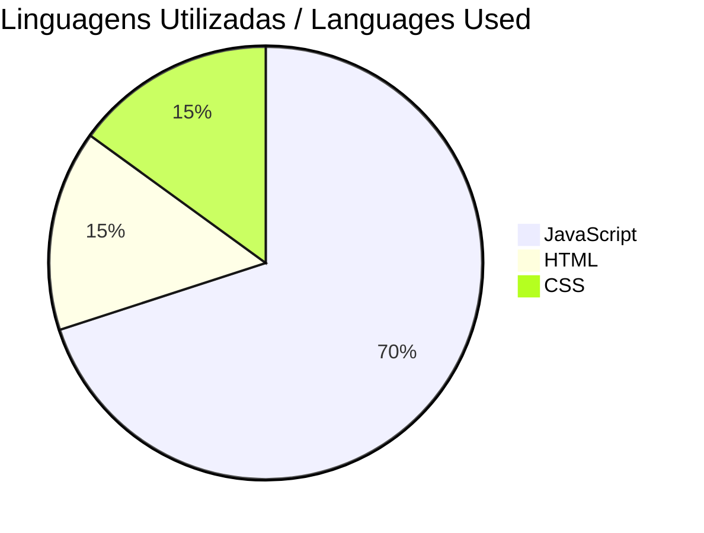

# README

## Descrição / Description

### Português
Este é um projeto React para uma loja online. Ele permite que os usuários naveguem por produtos, adicionem itens ao carrinho e façam compras. As funções principais usadas no React incluem hooks como `useContext`, `useState` e `useEffect`, componentes funcionais e roteamento com `react-router-dom`.

### English
This is a React project for an online store. It allows users to browse products, add items to the cart, and make purchases. The main functions used in React include hooks such as `useContext`,`useState` and `useEffect`, functional components, and routing with `react-router-dom`.

## Instalação / Installation

### Português
1. Clone o repositório: `git clone https://github.com/seu-usuario/seu-repositorio.git`
2. Navegue até o diretório do projeto: `cd seu-repositorio`
3. Instale as dependências: `npm install`
4. Inicie o servidor de desenvolvimento: `npm start`

### English
1. Clone the repository: `git clone https://github.com/your-username/your-repository.git`
2. Navigate to the project directory: `cd your-repository`
3. Install the dependencies: `npm install`
4. Start the development server: `npm start`

## Tecnologias Utilizadas / Technologies Used

## Contato / Contact

- **WhatsApp:** +55 35 98406-1841
- **LinkedIn:** [Rodrigo Marques Tavares](https://www.linkedin.com/in/rodrigo-marques-tavares-9482b4226/)